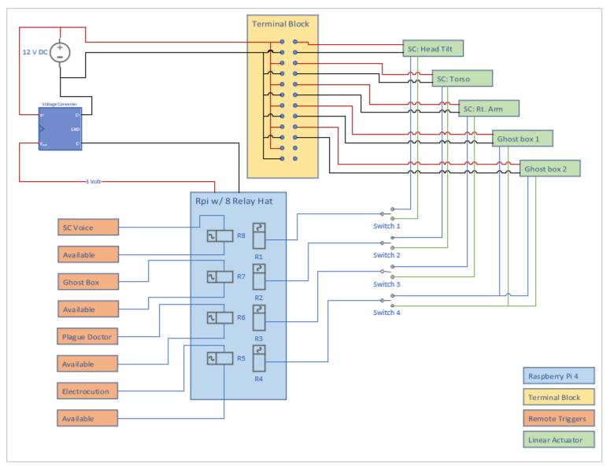
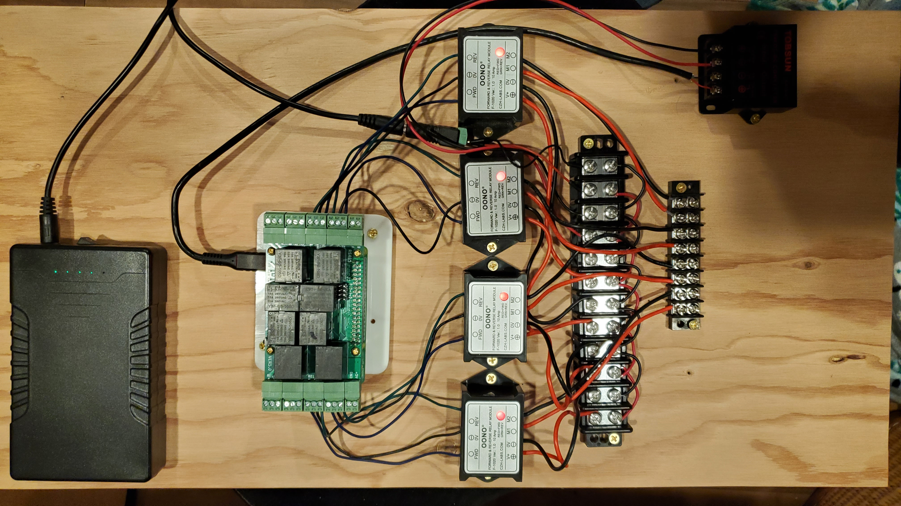

# Relay controller
Using 8 challen relay controller instead of the 3 channel ones from last year.  

## Wiring diagram
**Includes:**
- Raspberry Pi 4
- 12 volt power supply
- 12 -> 3 volt converter
- Actuator switch controls

</img>

</img>

In above image, channels 1, 2, 7 & 8 are used for the actuator switches.  The remaining four channels can trigger between 4 and 8 single fire circuits.  When wiring, have to make sure that the directional relay triggers hit pairs that make sense as if something is firing off of one direction of channel 3 and another something is firing off of the out, the second will have to be triggered before the first can be triggered again.
